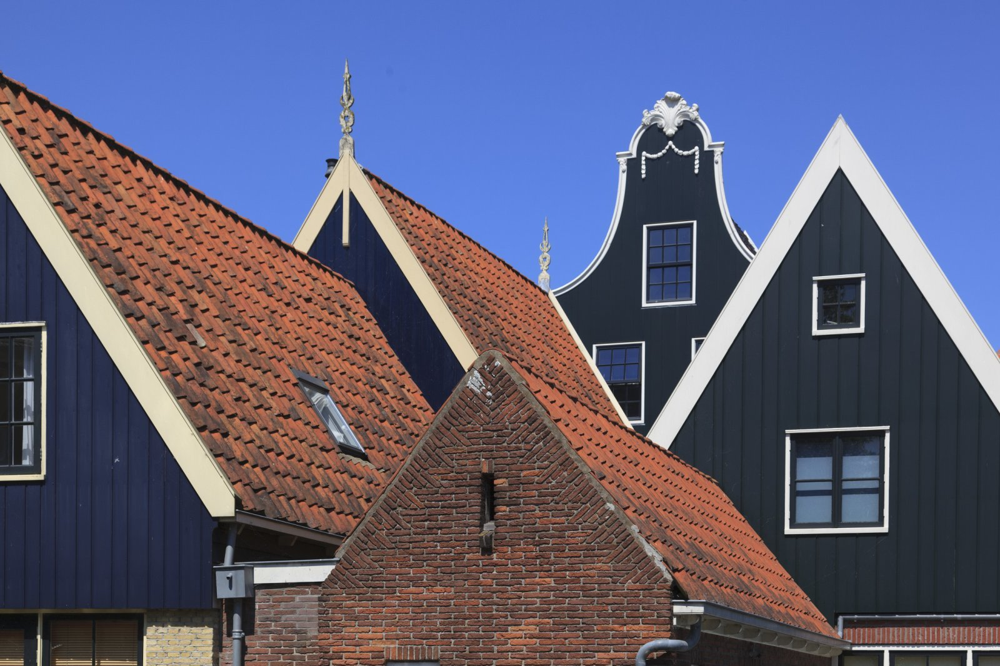
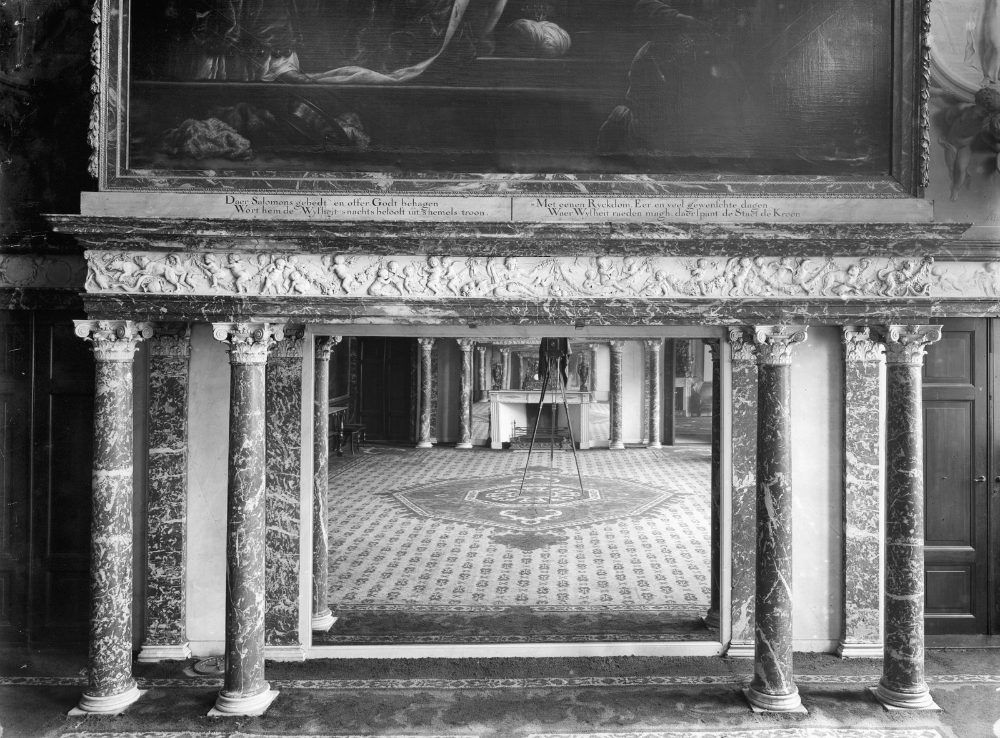
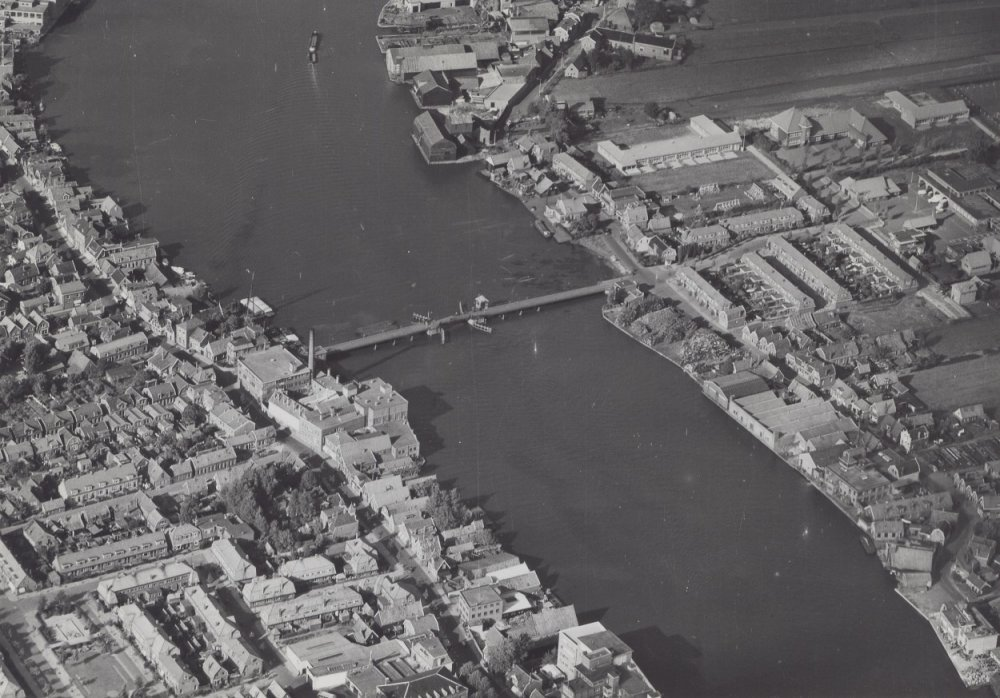
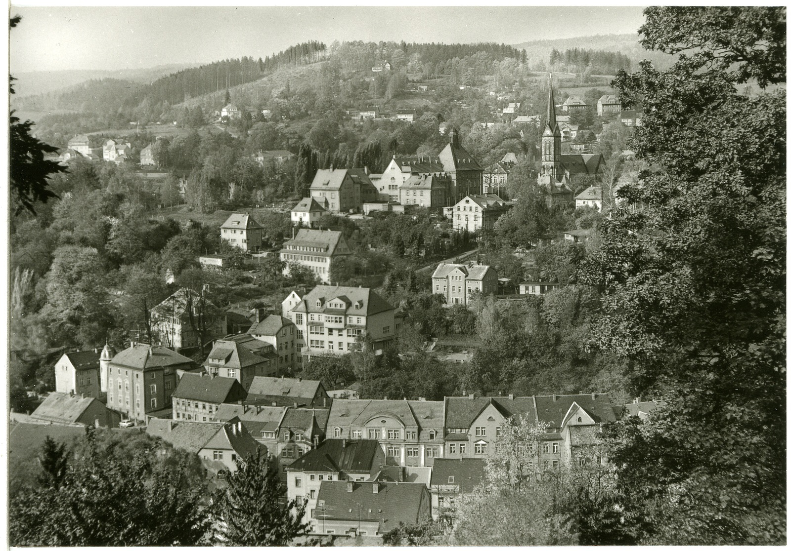
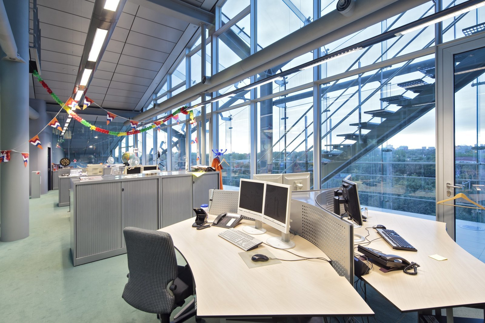
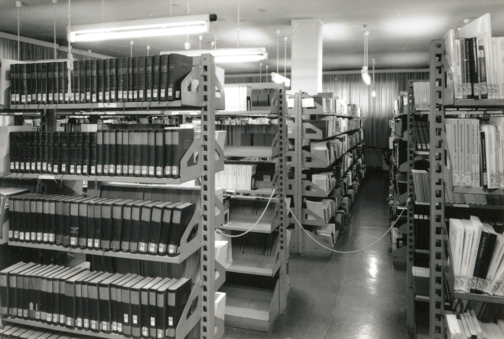

# Time
This is a wip project which at the moment just has the crawling method through Europeana API. The [website itself](https://www.europeana.eu/en) has an extensive collection of ~50 million historic ditial items from various sources.

Currently, this project would allow you to download images like below in a systematic yearly manner. The only variable that needs changing is the year in Download.py 

All downloaded images are free of copyright.

